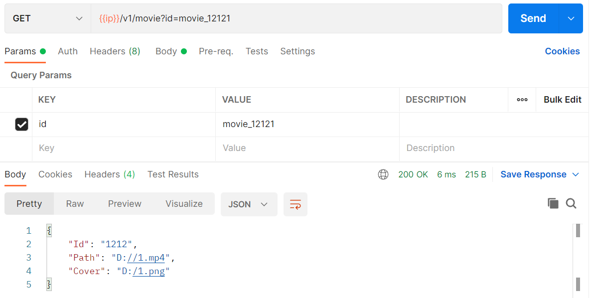
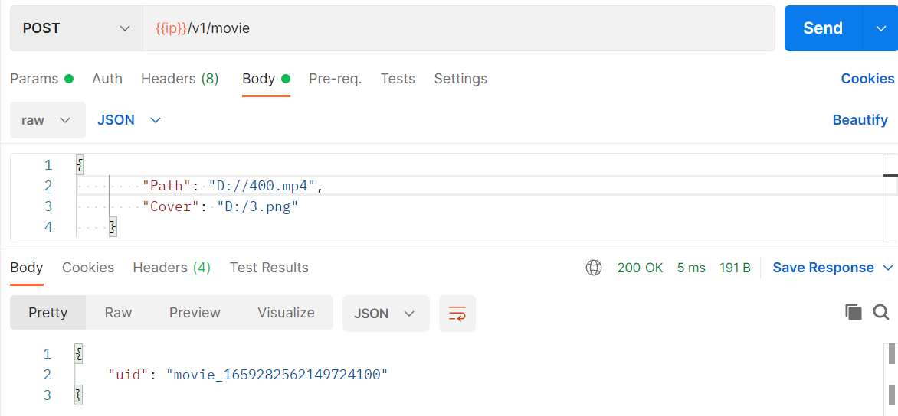
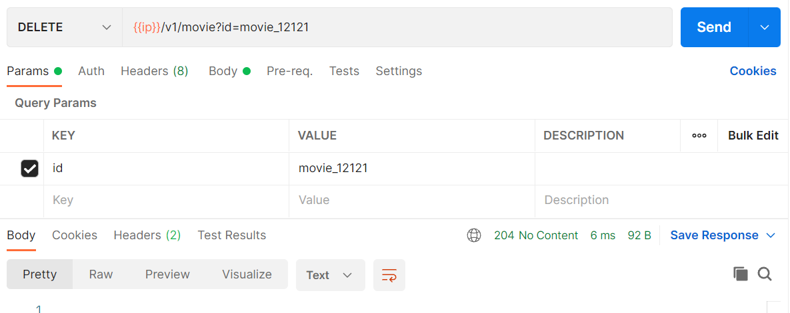
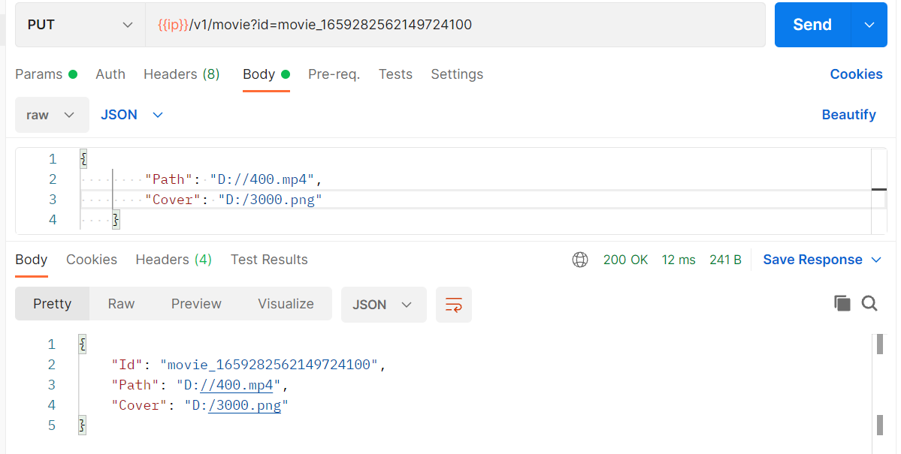

# 闭坑指南:
## 1，使用NSNamespace,NSInclude,路由返回404：
查看gopath是否为当前项目src一层，直接修改golandIDE的正确gopath
创新使用bee api 创建一个新项目，重新打开IDE运行即可

# 使用

cd lmdb/go_lmdb/src/lmdbapi 
bee run

测试端用postman
/v1/movie
GET

POST

DELETE

PUT

/v1/filter